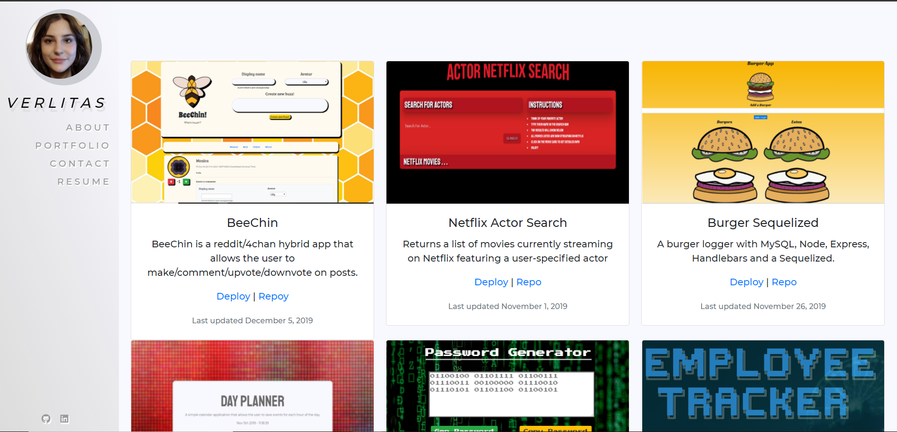

# December-Updated-Portfolio


## Description
An updated portfolio to demonstrate the progression of my current skills

## Table of Contents
* [Installation](#installation)
* [Screenshot](#screenshot)
* [Credits](#credits)

## Installation
In your terminal type: 
```git clone https://github.com/verlitas/BeeChin.git```
* Open in Visual Studio to build and run.
* For further instructions, visit https://help.github.com

## Screenshot

Live link: https://verlitas.github.io/December-Updated-Portfolio/


## Credits
[UABootCamp](https://bootcamp.ce.arizona.edu/coding/)  
